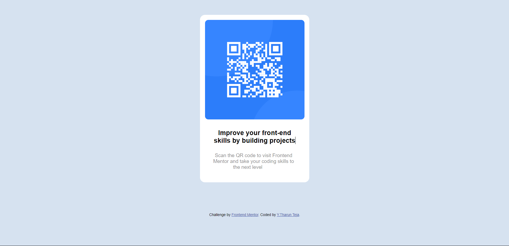
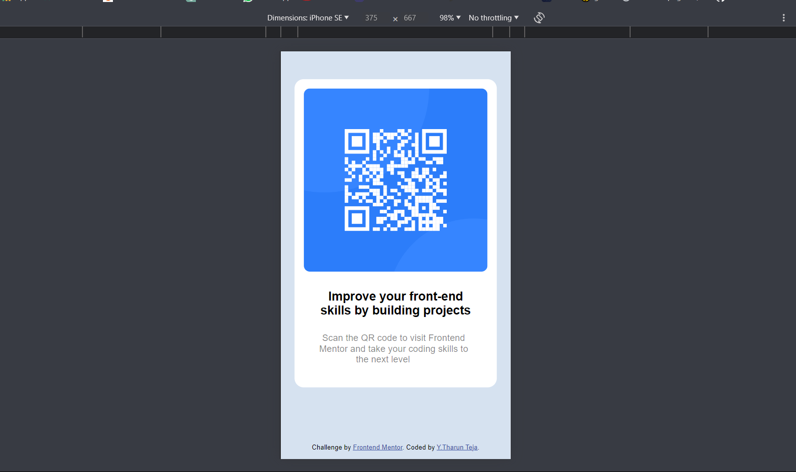

 # Frontend Mentor - QR code component solution

This is a solution to the [QR code component challenge on Frontend Mentor](https://www.frontendmentor.io/challenges/qr-code-component-iux_sIO_H). Frontend Mentor challenges help you improve your coding skills by building realistic projects. 

## Table of contents

- [Overview](#overview)
  - [Screenshot](#screenshot)
- [My process](#my-process)
  - [Built with](#built-with)
  - [What I learned](#what-i-learned)
  - [Continued development](#continued-development)
- [Author](#author)

## Overview

### Screenshot
-website in Desktop (screenshot)

-website in Mobile (screenshot)

## My process

### Built with

- Semantic HTML5 markup
- CSS custom properties
- Flexbox
- CSS Grid

### What I learned
From this project I learned how to use padding ina corrext manner,where to use felx box.I always use flex box for all my previous builts but here here I simply used padding to simply di this,it helped me a lot to figure out these things.

 
### Continued development
I learned padding in a special way that helped me to simply the design so I want to include all the things learned from tis challenge.

## Author

- Name : Y THARUN TEJA
- Frontend Mentor - [@yourusername](https://www.frontendmentor.io/profile/yourusername)

